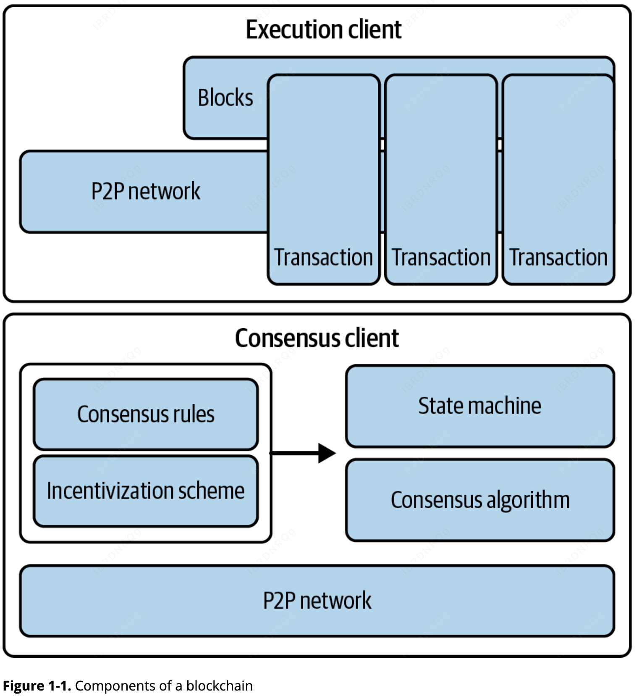

# 第 1 章：以太坊是什么？ (What Is Ethereum?)

以太坊（Ethereum）常被称为“世界计算机”。但这究竟意味着什么？我们将从计算机科学的角度出发，通过分析以太坊的功能与特性，并将其与比特币及其他去中心化信息交换平台（确切地说，是区块链）进行对比，来揭开它的面纱。

##  定义以太坊

* **从计算机科学视角看**：以太坊是一个**确定的（Deterministic）但实际上无界的状态机**。它由一个全球可访问的**单例状态（Singleton State）**和一个用于对该状态应用更改的**虚拟机（Virtual Machine）**组成。
* **从实用角度看**：以太坊是一个开源的、全球去中心化的计算基础设施，用于执行名为**智能合约（Smart Contracts）**的程序。它利用区块链来同步和存储系统的状态变更，并使用名为**以太币（Ether）**的加密货币来计量和限制执行资源的成本[^1]。

以太坊平台使开发者能够构建具有内置经济功能的强大去中心化应用（DApps）。它在提供高可用性、可审计性、透明性和中立性的同时，减少或消除了审查风险，并降低了特定的对手方风险。

---

## 以太坊与比特币的对比

许多人在接触以太坊之前都有过其他加密货币（特别是比特币）的使用经验。以太坊与比特币有许多共同点：连接参与者的点对点（P2P）网络、用于同步状态更新的拜占庭容错共识算法、密码学原语（如数字签名和哈希）以及数字货币（以太币）。

然而，在许多方面，以太坊的目的和架构与之前的开源区块链截然不同：

1.  **目的不同**：以太坊的主要目的并非作为一个数字货币支付网络。虽然以太币是其运行不可或缺的一部分，但它被定位为一种**功能性货币（Utility Currency）**，用于支付使用以太坊这台“世界计算机”的费用。
2.  **通用性（图灵完备）**：比特币的脚本语言受限，仅能进行简单的逻辑判断。而以太坊旨在成为通用的、可编程的区块链，其运行的虚拟机能够执行任意复杂度的代码。以太坊是**图灵完备（Turing Complete）**的，这意味着它可以作为一台通用计算机运行。
3.  **共识模型**：2022 年 9 月，以太坊通过 **"合并" (The Merge)** 升级，将其共识模型从工作量证明（PoW）转变为**权益证明（PoS）**。这一转变不仅大幅降低了环境影响，还增强了系统的可扩展性和安全性。

---

## 区块链的组成部分

一个典型的开源公共区块链通常由以下组件构成：

* **P2P 网络**：基于标准的“传播（Gossip）”协议连接参与者，传播交易和经过验证的区块。
* **消息（交易）**：代表状态转换的交易信息。
* **共识规则**：规定了什么是合法交易以及什么是有效的状态转换。
* **状态机**：根据共识规则处理交易的组件。
* **区块链（账本）**：由密码学保护的区块链条，记录所有已验证并接受的状态转换轨迹。
* **共识算法**：通过强制参与者遵守规则，实现对区块链的去中心化控制。
* **激励方案**：基于博弈论设计的方案（如 PoW 成本加区块奖励，或 PoS 质押奖励），在开放环境中保护状态机的经济安全。
* **开源代码实现（客户端）**：上述组件的软件实现。

### 客户端的演变
通常情况下，所有或绝大部分组件都会集成在单一的软件客户端中。例如在比特币中，其参考实现是由 Bitcoin Core 开源项目开发并作为“比特币客户端”运行的。在转为权益证明（PoS）机制之前，最初的以太坊也同样需要单一客户端。

然而，现在的以太坊利用了两个相互独立的客户端：一个负责共识（Consensus），另一个负责执行（Execution）。与提供参考实现不同，以太坊依赖的是参考规范（Reference Specification）：即在[《黄皮书》](https://oreil.ly/IJ7_B)中详细描述的数学定义，该规范随以太坊的发展一直在持续更新。目前，以太坊社区正致力于为[共识](https://oreil.ly/yjU6s)和[执行](https://oreil.ly/ggODg)客户端开发一套由 Python 编写的参考规范。许多客户端已根据这套参考规范构建完成。我们将在第三章深入探讨这一主题。

### 图 1-1：区块链组件示意图
以下是这些组件如何协同工作的逻辑结构：

在过去，我们习惯用“区块链”这个词作为缩写，来代指包含了上述所有特性的技术组合。然而在今天，区块链的种类繁多且属性各异。我们需要通过一些修饰词来准确理解特定区块链的特征，例如：**开放、公共、全球化、去中心化、中立**以及**抗审查**。只有具备了这些修饰词，才能识别出由上述组件构建而成的“区块链”系统所具备的重要涌现特性。

区块链并非千篇一律。尽管它们表现出的属性极其多样，但我们大致可以将区块链归为**许可链 vs 无许可链**，以及**公有链 vs 私有链**两大维度：

**无许可链 (Permissionless)**

无许可区块链（如比特币和以太坊）对所有人开放。这种去中心化网络允许任何人加入、参与共识过程以及读写数据，通过透明度来建立信任。

**许可链 (Permissioned)**

许可区块链对访问权限进行了限制，仅允许经过授权的参与者加入网络并执行特定操作。

**公有链 (Public)**

公有区块链是去中心化的，并向所有人开放。它允许广泛的参与者加入网络活动，并通过大规模的分布式存储和共识机制来确保透明度。

**私有链 (Private)**

私有区块链将访问权限限制在特定的参与者群体中，通常存在于组织内部或受信任的合作伙伴之间。

## 以太坊的诞生 (The Birth of Ethereum)
所有的伟大创新都是为了解决实际问题，以太坊也不例外。以太坊构思于人们意识到比特币模式的强大力量、并试图超越加密货币应用的时代。但当时的开发者面临着一个难题：要么在比特币之上构建，要么开启一条全新的区块链。

在比特币之上构建，意味着必须受限于该网络刻意设置的约束，并试图寻找各种绕过限制的方法。比特币有限的交易类型、数据类型和存储容量，似乎限制了能直接在其上运行的应用类型；任何除此之外的功能都需要额外的链下层支持，而这会立即削弱使用公有中心化账本的诸多优势。对于那些既需要留在链上、又需要更多自由度和灵活性的项目来说，打造一条新链是唯一的选择。但那意味着海量的工作：从头开始引导所有基础设施元素、进行详尽的测试等等。

2013 年底，年轻的程序员兼比特币爱好者维塔利克·布特林（Vitalik Buterin）开始思考如何进一步扩展比特币和 Mastercoin（一种在比特币之上运行、提供初步智能合约的覆盖协议）的功能。同年 10 月，布特林向 Mastercoin 团队提出了一种更通用的方法，允许使用灵活且可脚本化（但非图灵完备）的合约来取代 Mastercoin 专门的合约语言。虽然 Mastercoin 团队对此印象深刻，但这一提议改动过于激进，无法纳入他们的开发路线图。

2013 年 12 月，布特林开始分享一份白皮书，概述了以太坊背后的构想：一个图灵完备的通用区块链。几十人看到了这份早期草案并提供了反馈，帮助布特林完善了这项提案。

本书的两位原作者——安德烈亚斯·M·安东诺普洛斯（Andreas M. Antonopoulos）和加文·伍德博士（Dr. Gavin Wood）都收到了白皮书的早期草案并发表了评论。安东诺普洛斯对使用独立区块链来强制执行智能合约共识规则的想法，以及图灵完备语言的影响深感兴趣。他一直关注着以太坊的进展，但当时正处于创作《精通比特币》的早期阶段，直到很久以后才直接参与以太坊。而伍德则是最早联系布特林并表示愿意提供 C++ 编程支持的人之一。伍德随后成为了以太坊的联合创始人、共同设计者以及首席技术官（CTO）。

布特林（Buterin）在其《以太坊协议前传》（[A Prehistory of the Ethereum Protocol](https://oreil.ly/kEjpX)）一文中回忆道：

> “那时以太坊协议完全是我个人的创作。然而从那时起，新的参与者开始加入其中。在协议方面，目前为止最突出的人物是加文·伍德（Gavin Wood）。”

以太坊愿景的微妙转变很大程度上也要归功于伍德：它从最初被视为一个构建“可编程货币”的平台——即基于区块链、能够持有数字资产并根据预设规则进行转移的合约——转变为被视为一个通用计算平台。这种转变始于侧重点和术语的微妙变化，随后随着对“Web3”概念（Web3 ensemble）的日益强调，这种影响力变得更加强劲。在 Web3 的愿景中，以太坊只是去中心化技术套件中的一环，另外两环分别是 Whisper（通信）和 Swarm（存储）。从 2013 年 12 月开始，布特林和伍德不断完善和演进这一构想，共同构建了最终成为“以太坊”的协议层。

以太坊的创始人们思考的是一种没有特定用途的区块链，它可以通过编程支持广泛的应用。其核心理念是：通过使用像以太坊这样的通用区块链，开发者可以编写自己的特定应用，而无需去实现 P2P 网络、区块链、共识算法等底层机制。以太坊将这些细节抽象化，并为编写去中心化应用（DApps）提供了一个确定且安全的环境。

这种思维转变不仅简化了开发工作，还从根本上扩展了区块链的功能。它为全新的领域奠定了基础，如去中心化金融（DeFi）、NFT 以及去中心化自治组织（DAO），而这些在早期的单一用途区块链上是不可能实现的。

正如中本聪（Satoshi Nakamoto，比特币的匿名开发者）一样，布特林和伍德不仅仅是发明了一项新技术，他们还以一种新颖的方式将新发明与现有技术结合起来，并交付了原型代码向世界证明他们的构想。

创始人们花费了数年时间来构建和完善他们的愿景。2015 年 7 月 30 日，以太坊的第一个区块被成功挖掘。“全球计算机”开始为世界提供服务。

> [!Note]
> 维塔利克·布特林的[《以太坊协议前传》](https://oreil.ly/kEjpX)发表于 2017 年 9 月，以第一人称视角生动地记录了以太坊最初的时刻。

## 以太坊的发展阶段 (Stages of Development)

以太坊的开发被划分为四个主要阶段，每个阶段都通过**硬分叉（Hard Forks）**引入重大功能。目前的开发已进入最后的“宁静”阶段。

#### 第一阶段：前沿 (Frontier) - 2015 年 7 月 30 日
* **定位**：创世阶段，为矿工和开发者铺平道路。
* **关键点**：开启 ETH 交易，引入**难度炸弹（Difficulty Bomb）**。
    * *注：难度炸弹旨在通过指数级增加挖矿难度，促使网络最终从 PoW 转向 PoS。*

#### 第二阶段：家园 (Homestead) - 2016 年 3 月 14 日
* **定位**：使网络更安全、更稳定。
* **关键点**：引入了 EIP-2、EIP-7 和 EIP-8 等关键协议更新，虽然仍处于测试阶段，但开发者友好度大幅提升。

#### 第三阶段：大都会 (Metropolis) - 2017 年 10 月 16 日
* **定位**：提升功能性，推动 DApp 的创建。
* **重要分叉**：
    * **拜占庭 (Byzantium)**：优化 Gas 成本，减少挖矿奖励。
    * **君士坦丁堡 (Constantinople)**：优化底层逻辑。
    * **伊斯坦布尔 (Istanbul)**：增强抗 DDoS 能力，引入 **零知识证明 (zk-SNARKs/STARKs)**，为扩展性和隐私奠定基础。

#### 第四阶段：宁静 (Serenity) - 2022 年 9 月 15 日
这是以太坊历史上最重大的升级，即 **以太坊 2.0**。其核心目标是将网络从 PoW 彻底转型为 **权益证明（PoS）**，使其更可持续、高效。

与之前阶段不同，Serenity 后的六个子阶段正在**并行开发**中：

| 子阶段名称 | 核心目标 (Core Goal) |
| :--- | :--- |
| **合并 (The Merge)** | 官方从 PoW 转向 PoS，能耗降低 99% 以上。[^2] |
| **激增 (The Surge)** | 引入**分片 (Sharding)** 技术，大幅提升每秒交易数（TPS）。 |
| **祸根 (The Scourge)** | 解决中心化和抗审查问题，确保网络开放性。 |
| **边缘 (The Verge)** | 引入 **Verkle 树**，优化节点数据存储，提升效率。 |
| **清洗 (The Purge)** | 减少历史过时数据，减轻节点存储压力。 |
| **挥霍 (The Splurge)** | 一系列细节优化，确保所有重大变更后的平稳运行。 |

## 以太坊：通用的区块链 (A General-Purpose Blockchain)

最初的区块链——即比特币区块链——追踪的是比特币单位的状态及其所有权。你可以将比特币理解为一个分布式共识状态机，其中每一笔交易都会引发一次全局的状态转换，从而改变货币的所有权。这些状态转换受共识规则的约束，使得所有参与者在若干区块被开采后，能够（最终）收敛到系统的一个共同（共识）状态。

以太坊同样是一个分布式状态机。但以太坊追踪的不仅是货币所有权的状态转换，它还追踪一个通用数据存储（general-purpose data store）的状态转换——也就是说，这个存储可以保存任何能以键值对（key-value tuple）表达的数据。键值数据库可以保存任意数值[^3]，每个数值通过特定的键来引用：例如，通过键“书名”可以引用值“《精通以太坊》”。从某种意义上说，这与大多数通用计算机使用的随机存取存储器（RAM）的数据存储模型具有相同的功能。

以太坊拥有的存储空间可以同时保存代码和数据，并利用以太坊区块链来追踪这些存储内容随时间变化的过程。就像一台通用的、“存储程序式”计算机一样，以太坊可以将代码加载到其状态机中并运行这些代码，然后将产生的状态变化记录在区块链中。

与大多数通用计算机相比，以太坊有两个核心区别：一是状态变化受共识规则支配，二是状态是全球分布的。以太坊回答了这样一个问题：“如果我们能够追踪任何任意状态，并对状态机进行编程，从而创造出一台在共识下运行的全球计算机，会发生什么？”

## 以太坊的核心组件 (Ethereum’s Components)

在以太坊中，“区块链组成部分”的具体实现细节如下：

#### **P2P 网络**
以太坊运行在以太坊主网（Ethereum Main Network）上。该网络通过 TCP 端口 `30303` 进行寻址，并运行名为 [ÐΞVp2p](https://oreil.ly/pUfGC) 的底层协议。

#### **共识规则**
以太坊最初的共识协议是 **Ethash**（一种在“黄皮书”规范中定义的 PoW 模型）。随后在 2022 年 9 月的“合并（The Merge）”升级期间，共识规则演变为**权益证明（PoS）**模型（详见第 15 章）。

#### **交易 (Transactions)**
以太坊交易是网络消息，其包含的内容主要有：发送者（Sender）、接收者（Recipient）、数值（Value）以及数据载荷（Data Payload）。

#### **状态机 (State Machine)**
以太坊的状态转换由**以太坊虚拟机（EVM）**处理。EVM 是一个基于堆栈的虚拟机，用于执行**字节码（Bytecode）**。被称为**智能合约**的 EVM 程序由高级语言（如 Solidity）编写，并编译成字节码后在 EVM 上运行。

#### **数据结构**
以太坊的状态以数据库形式（通常是 Google 的 **LevelDB**）本地存储在每个节点上。该数据库通过一种名为 **Merkle-Patricia Trie（梅克尔-帕特里夏树）** 的序列化哈希数据结构来记录交易和系统状态。

#### **共识算法**
以太坊从 PoW 转型为 PoS 共识机制，以提高能效和可扩展性。在 PoS 中，验证者通过质押加密货币来获取验证交易、创建新区块和维护网络安全的权利。以太坊的 PoS 是两种不同算法的融合：**Casper FFG**（友好终结性小工具）和 **LMD GHOST**（由最新消息驱动的贪婪最重观测子树）。

#### **经济安全**
以太坊使用名为 **Gasper** 的 PoS 算法为区块链提供经济安全性。我们将在第 15 章详细探讨 Gasper 的工作原理，包括它在终结性（Finality）和验证者协调中的作用。

#### **客户端 (Clients)**
以太坊拥有多个可互操作的执行层和共识层客户端软件实现。目前最主流的包括：
* **执行层客户端**：Go-ethereum (Geth)、Nethermind
* **共识层客户端**：Prysm、Lighthouse
* **Engine API**：在当前的 Serenity 阶段，执行客户端与共识客户端之间是通过 Engine API 进行通信的。这种架构实现了以太坊计算逻辑与共识逻辑的完美解耦。
---

#### 延伸阅读资源

* [以太坊“黄皮书” (Ethereum Yellow Paper)](https://ethereum.github.io/yellowpaper/paper.pdf)
* [共识客户端 Python 规范 (Consensus Client Python Specifications)](https://github.com/ethereum/consensus-specs)
* [执行层客户端 Python 规范 (Execution Client Python Specifications)](https://github.com/ethereum/execution-specs)

## 以太坊与图灵完备性 (Ethereum and Turing Completeness)

一旦你开始了解以太坊，就会接触到图灵完备（Turing complete）这个词。人们常说，与比特币不同，以太坊是图灵完备的。这究竟意味着什么呢？

这个术语源于被誉为“计算机科学之父”的英国数学家艾伦·图灵（Alan Turing）。1936 年，他创建了一个计算机数学模型，该模型由一个状态机组成，通过在顺序存储介质（类似于无限长的纸带）上读写符号来处理信息。通过这一构想，图灵建立了数学基础，用以回答关于通用可计算性（universal computability）的问题（即是否所有问题都是可解的），而他的结论是否定的。他证明了存在某些类别的问题是不可计算的。具体而言，他证明了停机问题（halting problem）——即给定一个任意程序及其输入，判断该程序最终是否会停止运行——是不可解的。

图灵进一步定义：如果一个系统可以用来模拟任何图灵机，那么该系统就是图灵完备的。这样的系统被称为通用图灵机（Universal Turing Machine, UTM）。

以太坊在一个名为 EVM（以太坊虚拟机） 的状态机中执行存储程序，同时在内存中读写数据，这种能力使其成为一个图灵完备系统，因此也是一个通用图灵机。在有限内存的限制下，以太坊可以计算任何图灵机能够计算的算法。

以太坊的开创性创新在于：它将存储程序计算机的通用计算架构与去中心化区块链相结合，从而创造了一个分布式的单状态（singleton）全局计算机。以太坊程序在“任何地方”运行，却能产生一个由共识规则保护的共同状态[^4]。

## 图灵完备性作为一种“特性” (Turing Completeness as a “Feature”)

当你听到以太坊是图灵完备的，可能会得出这样的结论：对于那些非图灵完备的系统来说，这似乎是一种缺失的“特性”。事实恰恰相反。

实现图灵完备其实非常容易。事实上，目前已知[最简单的图灵完备状态机](https://oreil.ly/JhL2o)仅包含 4 个状态和 6 个符号，其状态定义仅有 22 条指令。确实，有些系统有时会被发现是“无意中实现图灵完备的”（这里有一些关于此类系统的[有趣参考](https://oreil.ly/7pt2q)）。

然而，由于前一节所述的“停机问题”，图灵完备性是非常危险的，特别是在像公有区块链这种开放访问的系统中。举例来说，现代打印机就是图灵完备的，如果给它们发送某些特定的打印文件，可能会导致打印机进入死机状态。以太坊是图灵完备的，这意味着以太坊可以计算任何复杂程度的程序。但这种灵活性也带来了一些棘手的安全和资源管理问题。一台死机的打印机可以通过关闭电源再重新开启来解决，但在公有区块链上，这（重启）是不可能实现的。

## 图灵完备性的影响 (Implications of Turing Completeness)

图灵证明了你无法通过在计算机上模拟一个程序来预测它是否会终止。简单来说，在不实际运行程序的情况下，我们无法预测它的运行路径。图灵完备系统可能会陷入死循环（infinite loops）——这是一个用来描述（虽然有些简化）程序永远不会终止的术语。创建一个永不结束的循环程序非常简单，但由于初始条件与代码之间复杂的相互作用，意料之外的死循环可能会在没有任何预警的情况下发生。

在以太坊中，这提出了一个挑战：每个参与节点（客户端）都必须验证每一笔交易，并运行其调用的任何智能合约。但正如图灵所证明的，以太坊在不实际运行智能合约的情况下，无法预测它是否会终止或将运行多久（甚至可能永远运行下去）。无论是无意还是刻意，一个智能合约可能被设计成在节点尝试验证它时永久运行。这实际上构成了一种拒绝服务攻击（DoS）。当然，在验证只需一毫秒的程序与永久运行的程序之间，还存在着无数令人厌恶、占用资源、撑大内存、导致 CPU 过热的“资源消耗型”程序，它们纯粹是在浪费资源。在一台全球计算机中，一个滥用资源的程序就是在滥用全世界的资源。

如果以太坊无法预知资源的使用情况，它该如何约束智能合约所消耗的资源呢？

为了应对这一挑战，以太坊引入了一种名为 Gas 的计量机制。当 EVM 执行智能合约时，它会仔细计算每一条指令（计算、数据访问等）的开销。每条指令都有一个以 Gas 为单位的预设成本。当一笔交易触发智能合约执行时，它必须包含一定数量的 Gas，作为运行该合约所能消耗的上限。如果计算消耗的 Gas 超过了交易中可用的 Gas 数量，EVM 将终止执行。Gas 便是以太坊在允许图灵完备计算的同时，限制任何程序消耗资源的核心机制。

接下来的问题是：如何获得 Gas 来支付以太坊全球计算机上的计算费用？你不会在任何交易所找到 Gas。它只能作为交易的一部分被购买，且只能用 以太（Ether） 购买。以太需要随交易一起发送，并明确拨出部分资金按可接受的 Gas 价格（Gas Price） 购买 Gas。就像在加油站一样，Gas 的价格并不是固定的。交易购买 Gas 后执行计算，任何未使用的 Gas 都会退还给交易发送者[^5]。

## 从通用区块链到去中心化应用 (From General-Purpose Blockchains to DApps)

以太坊 (Ethereum) 最初是作为一种构建通用区块链的方法而诞生的，它可以针对各种用途进行编程。但很快，以太坊的愿景扩展成为一个开发 **DApps** (去中心化应用) 的平台。**DApps** 代表了比智能合约 (smart contracts) 更广阔的视角。一个 **DApp** 至少由一个智能合约和一个 Web 用户界面组成。更广泛地说，**DApp** 是构建在开放、去中心化、P2P 基础设施服务之上的 Web 应用程序。

一个 **DApp** 至少包含以下组成部分：

* 区块链上的智能合约 (Smart contracts)
* Web 前端用户界面

此外，许多 **DApps** 还包括其他去中心化组件，例如：

* 去中心化 (P2P) 存储协议与平台
* 去中心化 (P2P) 消息协议与平台

从实践角度来看，以太坊的 web3.js JavaScript 库充当了浏览器端 JS 应用与以太坊区块链之间的桥梁。最初，它还包含了名为 Swarm 的 P2P 存储网络和名为 Whisper 的 P2P 消息服务——这些工具使得开发全去中心化的 Web3 DApp 成为可能。尽管这种全去中心化的 DApp 设计极具吸引力，但在随后的几年里并未获得太大的市场牵引力。为了改善用户体验并提高用户采用率，人们不得不接受一些折中方案。如今，通过中心化的 Web2 网站与智能合约进行交互已成为 DApp 的标准形式。

## 互联网的第三个时代 (The Third Age of the Internet)

2004 年，“Web 2.0”一词开始流行，作为万维网向用户生成内容、响应式界面和交互性演进的标签。Web 2.0 并不是一种技术规范，而是一个描述 Web 应用程序新重心的术语。

DApps（去中心化应用）的概念旨在将 Web 推向其下一个自然演进阶段，即将点对点（P2P）协议的去中心化特性引入 Web 应用程序的各个方面。描述这一演进的术语是 Web3，意为 Web 的第三个“版本”。Web3 最初由加文·伍德（Gavin Wood）提出，代表了 Web 应用程序的一种新愿景和新重心：从中心化所有和管理的应用程序，转型为构建在去中心化协议之上的应用程序。

## 以太坊的开发文化 (Ethereum’s Development Culture)

到目前为止，我们已经讨论了以太坊的目标和技术与比特币 (Bitcoin) 等前辈区块链有何不同。除此之外，以太坊还拥有一种截然不同的开发文化。
在比特币中，开发受保守原则指导：所有变更都经过仔细研究，以确保不会破坏现有系统。在大多数情况下，只有在具备向后兼容性 (backward compatible) 时才会实施更改。现有客户端可以选择加入，但如果决定不升级，也能继续运行。这种谨慎的方法与比特币的治理模型相一致，其变更必须通过比特币改进提案 (**BIP**) 流程——这是一个刻意放慢速度、由共识驱动的流程，旨在维护系统稳定性。
相比之下，以太坊社区的开发文化更关注未来而非过去。其（并非完全严肃的）口号是“快速行动，打破常规”(move fast and break things)。如果需要某项变更，它就会被实施，即便这意味着推翻先前的假设、破坏兼容性或强制客户端更新。以太坊的治理反映了这种更具实践性的风格，通过频繁的 **AllCoreDevs**（全核心开发者）公开会议进行协调，研究员、客户端团队和生态系统利益相关者在会上讨论并就即将到来的变更达成一致。这是一个更加敏捷和迭代的过程，以牺牲部分稳定性为代价换取更快的创新步调。

作为开发者，这意味着你必须保持灵活性，并准备好在底层假设发生变化时重建你的基础设施。以太坊开发者面临的一大挑战是：将代码部署到不可篡改 (immutable) 的系统与一个仍在演进的开发平台之间存在内在矛盾。你无法简单地“升级”你的智能合约。你必须准备好部署新合约，迁移用户、应用和资金，并重新开始。讽刺的是，这也意味着构建更具自治性和更少中心化控制系统的目标尚未完全实现。自治和去中心化要求平台具备比未来几年以太坊所能提供的更高的稳定性。为了让平台“演进”，你必须准备好废弃并重启你的智能合约，这意味着你必须对它们保留一定程度的控制权。但从积极的一面来看，以太坊正在飞速前进。这里几乎没有“自行车棚效应” (**bike-shedding**) 的空间——这个词指的是为了细枝末节（比如核电站后方的自行车棚怎么盖）而争论不休，从而延误开发。如果你开始纠结于琐事，你可能会突然发现，当你分心时，其他开发团队已经改变了计划，抛弃了自行车，转而开发自主悬浮器了。最终，以太坊平台的开发会慢下来，其接口也会固定。但在那之前，创新是核心原则。你最好紧跟步伐，因为没有人会为了等你而减速。

## 为什么要学习以太坊？ (Why Learn Ethereum?)

区块链的学习曲线非常陡峭，因为它将多个学科整合到了一个领域：编程、信息安全、密码学、经济学、分布式系统、P2P 网络等等。以太坊 (Ethereum) 显著降低了这条学习曲线的坡度，让你能够快速入门。但在那个看似简单的环境之下，隐藏着更深奥的内容。随着你的学习和深入探索，总会有另一层复杂性和奇迹等待着你。
以太坊是学习区块链的绝佳平台，它正在以超过任何其他区块链平台的速度建立一个庞大的开发者社区。更重要的是，以太坊是一个**属于开发者的区块链**：由开发者构建，为开发者服务。熟悉 JavaScript 应用程序的开发者可以迅速切入以太坊并开始编写可运行的代码。在以太坊诞生的前几年，经常可以看到印有“只需五行代码即可创建代币”字样的 T 恤。当然，这是一把双刃剑：编写代码很容易，但编写**高质量**且**安全**的代码却非常困难。
许多区块链项目（例如 L2 层扩展方案）都是基于以太坊构建的。学习以太坊能帮助你更好地理解这些项目，并为你提供探索区块链世界进一步发展的工具。对于任何想要参与最新区块链技术的人来说，这些知识都是关键。

### 结语 (Conclusion)

以太坊 (Ethereum) 在区块链领域中脱颖而出，是一个具有开创性的平台。它作为图灵完备 (Turing-complete) 系统的设计，使得创建具有复杂可编程逻辑的去中心化应用成为可能，这远远超出了比特币 (Bitcoin) 较为简单的功能范畴。

对于开发者和技术专家而言，理解以太坊为深入领悟区块链技术及其潜在应用开启了大门。通过精通以太坊，你将获得参与并贡献于这场正在进行的互联网演进的工具，让自己置身于这一激动人心领域的最前沿。

---

[^1]: 实际上经过优化后也可以使用稳定币做资源消耗的限制。
[^2]: 已经完成。 
[^3]: 通过这里可以推测出，以太坊的底层是一个KV数据库，应该是来自谷歌的LevelDB。
[^4]: 我自己觉得还有一个突破性的创新在于将计算机技术和社会科学相结合，使用经济学的方法限制图灵完备系统的副作用，死循环，避免了无法承受的计算开销。从PoW演进到PoS也是这种思路的体现。
[^5]: 虽然可以通过gas的单价进行解耦，但是使用稳定币计算gas的价格才是彻底的解耦。
