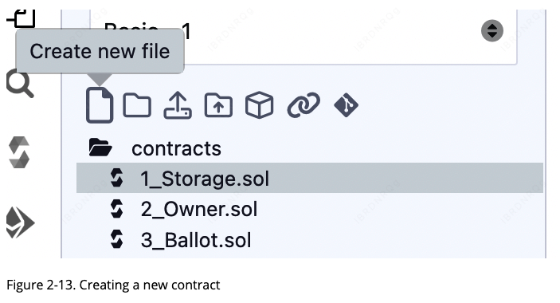
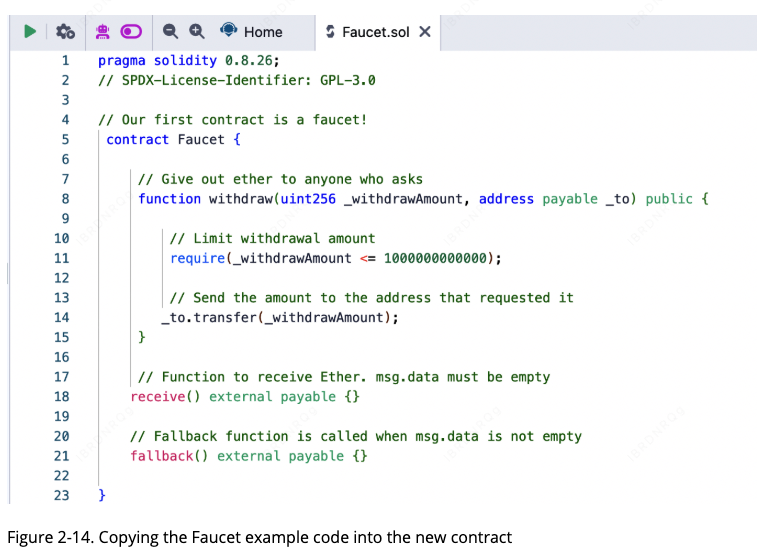
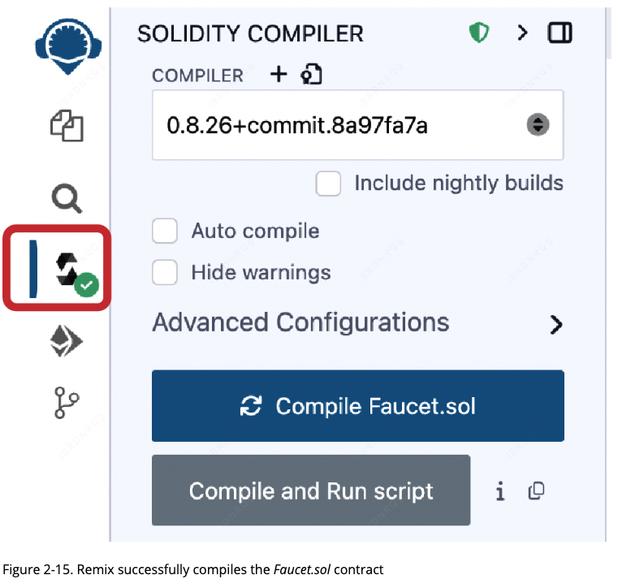

# 第二章：以太坊基础 (Exploring Ethereum)

在本章中，我们将开始探索以太坊 (Ethereum)。我们将讨论如何使用钱包、创建交易以及运行一个基础的智能合约 (Smart Contract)。

### 以太币货币单位 (Ether Currency Units)

以太坊的货币单位被称为 **以太币** (ether)，通常标识为 **ETH**，或使用符号 **Ξ**（源自希腊字母 Xi，看起来像一个艺术化的英文字母 E）以及较少使用的 **♦**。例如：1 ether, 1 ETH, Ξ1, 或 ♦1。

> [!TIP]
> 符号 **Ξ** 对应的 Unicode 字符为 `U+039E`，符号 **♦** 对应的 Unicode 字符为 `U+2666`。

以太币可以细分为更小的单位，最小的单位被称为 **wei**。1 个以太币等于 100 亿亿 (1 quintillion) **wei**（即 $1 \times 10^{18}$ 或 1,000,000,000,000,000,000 **wei**）。你可能也会听到人们将这种货币称为“以太坊”，但这其实是一个常见的初学者错误：以太坊 (Ethereum) 是系统名称，而以太币 (ether) 才是其货币。

在以太坊内部，以太币的值始终表示为以 **wei** 为单位的无符号整数 (`unsigned integer`)。当你交易 1 ether 时，交易实际上是将 1,000,000,000,000,000,000 **wei** 作为数值进行编码。

以太币的各种面额既有国际单位制 (SI) 的科学名称，也有为了向计算机科学和密码学领域的先驱致敬而命名的通俗名称。下表列出了各种单位、它们的通俗称呼以及 SI 名称。为了与内部价值表示保持一致，下表展示了以 **wei** 为基准的所有面额，其中以太币在第七行显示为 $10^{18}$ **wei**。

[](figure 2-1)


> [!NOTE]
> 常见的面额还包括 **Gwei** ($10^{9}$ **wei**)。在实际操作中，Gas 价格通常以 **Gwei** 为单位进行计价，这样比直接使用 **wei** 或 **ether** 更方便人类阅读。

---
### 选择以太坊钱包 (Choosing an Ethereum Wallet)

“钱包”一词涵盖了多重含义，尽管这些定义彼此关联，且在日常使用中殊途同归。我们将使用 **钱包** (wallet) 一词来指代帮助你管理以太坊账户的软件应用程序。简而言之，以太坊钱包是你进入以太坊系统的门户。它持有你的密钥，并能代表你创建和广播交易。

选择以太坊钱包可能具有挑战性，因为市面上有许多功能和设计各异的选项。有些更适合初学者，有些则更适合专家。由于以太坊平台本身仍在持续改进，那些能够适应平台升级所带来变化的钱包通常才是“最佳”选择。

不过不必担心！如果你选择了一个钱包却不喜欢它的工作方式，或者起初喜欢但后来想尝试其他产品，更换钱包是非常容易的。你只需发起一笔交易将资金从旧钱包发送到新钱包，或者导出你的私钥并将其导入到新钱包中即可。

请记住，钱包应用程序必须能够访问你的私钥才能正常工作，因此务必只从你信任的来源下载和使用钱包。幸运的是，通常情况下，钱包应用程序越流行，其可靠性往往越高。尽管如此，遵循“不要把所有鸡蛋放在一个篮子里”的原则是良好的习惯，建议将你的以太坊资产分散在多个钱包和助记词中。

以下是一些适合入门的钱包；选择这些钱包并不代表对其质量或安全性的背书，它们仅仅是演示和测试的良好起点。以下所有钱包均同时提供浏览器扩展版本和移动端版本：

* **MetaMask**：MetaMask 易于使用，且由于能够连接到各种以太坊节点和测试链，非常方便进行测试。
* **Rabby Wallet**：Rabby 通常是新用户的理想选择，因为它在设计上追求简单易用，并内置了大量的安全特性。
* **Phantom**：Phantom 是一款能够连接到以太坊以及其他非 **EVM** 链的钱包。

> [!WARNING]
> **私钥即资产**。绝不要将你的助记词或私钥输入到任何你不完全信任的网站或应用中。一旦私钥泄露，你的资金将无法追回。

> [!NOTE]
> 现代钱包（如 Rabby）通常具备“交易解析”功能，能在你签署交易前以人类可读的方式展示该交易将导致哪些资产变动，这极大地降低了误操作的风险。

---

> [!TIP] **译者注**：
> 1. **非托管性质 (Non-Custodial)**：从后端逻辑看，这些钱包属于“非托管”客户端。这意味着你的私钥加密存储在本地（如浏览器的 `LocalStorage` 或移动端的 `Secure Enclave`），钱包服务商的服务器并不存储你的私钥。作为开发者，理解这一点至关重要：你不是在向钱包“登录”账号，而是在通过钱包对数据进行**离线签名**，然后通过 `eth_sendRawTransaction` 接口将签名后的数据包发往 RPC 节点。
> 2. **HD 钱包与路径派生**：现代钱包多遵循 **BIP-32/44** 标准，即通过一个种子（助记词）派生出无数个私钥对。如果你在更换钱包软件后发现地址对不上，通常是因为不同钱包默认的“派生路径” (`derivation path`) 设置不一致，这在多链钱包（如 Phantom 接入以太坊）中尤为常见。
---
### 控制权与责任 (Control and Responsibility)

像以太坊 (Ethereum) 这样的开放区块链之所以重要，是因为它们作为一个**去中心化** (decentralized) 系统运行。这意味着很多层含义，但其中一个关键点在于：以太坊的每个用户都可以——也应该——控制自己的**私钥** (private keys)，以此控制对资金和智能合约的访问。

我们有时将资金访问权与智能合约访问权的组合称为**账户** (account) 或**钱包** (wallet)。这些术语在功能上可能相当复杂，我们稍后会详细展开。但作为一个基本原则，它可以简单理解为：**一个私钥等于一个“账户”**。有些用户选择通过使用第三方托管机构（如在线中心化交易所）来放弃对私钥的控制。在本书中，我们将教你如何掌握并管理自己的私钥。

拥有控制权意味着承担巨大的责任。如果你丢失了私钥，你就失去了对资金和合约的访问权。没有人能帮你找回访问权限——你的资金将被永久锁定。以下是一些帮助你承担这一责任的建议：

* **不要在安全问题上即兴发挥**：请使用经过测试的标准化方案。
* **账户越重要，安全措施应越高**：例如，该账户控制的资金占你总净值的比例越高，采取的安全措施就应越严密。
* **硬件钱包提供最高安全等级**：硬件钱包设备能提供最高级别的安全保障，但并非每个账户都需要这种级别。
* **切勿以明文形式存储私钥**：特别是不要以数字形式存储。幸运的是，如今大多数用户界面在没有多次警告的情况下，甚至不会让你看到原始私钥。
* **纸笔备份助记词**：当系统提示你备份助记词（作为助记单词序列）时，请使用纸笔进行物理备份。不要把这个任务留到“以后”，否则你会忘记。如果系统数据丢失或密码遗忘，这些备份可用于重建私钥。然而，攻击者也可以利用它们窃取你的私钥，因此切勿数字存储，并至少妥善保存一份物理副本。
* **大额转账前先进行小额测试**：在转移任何大额资金（尤其是向新地址）之前，先进行一笔小额测试交易（例如价值小于 1 美元），并等待确认收到。
* **双向测试新账户**：创建新账户时，先向新地址发送一笔小额测试资金。收到后，尝试从该账户将其发回。账户创建失败的原因有很多，如果出了问题，最好以微小的损失发现它。如果测试成功，则一切正常（也可以使用测试网来避免任何损失）。
* **合理利用区块浏览器**：公共区块浏览器 (Block Explorers) 是独立查看交易是否被网络接受的简便方法；虽然这些信息在区块链上是公开的，但浏览器让访问变得异常简单。然而，这种便利对隐私有负面影响，因为你会向浏览器泄露地址，从而可能被追踪。
* **不要盲目信任**：公共区块浏览器通常是可靠的，但并非始终如此——不要盲目信任它们。
* **禁止向书中的地址汇款**：不要向本书中显示的任何地址发送资金。书中列出了相关的私钥，任何人都可以立即取走那些钱。

现在我们已经涵盖了密钥管理和安全的一些基本最佳实践，让我们开始使用 MetaMask 吧！

> [!WARNING]
> 在区块链世界中，“**Not your keys, not your coins**”（无私钥即无资产）。一旦你将资产存入中心化交易所，你拥有的只是债权而非资产本身。

---

> [!TIP] **译者注**：
> 1. **确定性状态与不可逆性**：从后端架构视角看，传统系统通常有 `Undo` 或 `Admin Override` 逻辑，但在以太坊底层，状态转换一旦经过共识封装进区块，就具有了物理级的不可逆性。这要求后端开发者在设计与合约交互的逻辑时，必须引入“交易确认状态机”来处理 `Pending`、`Confirmed` 和 `Reverted` 各种情况。
> 2. **隐私泄露的风险向量**：文中提到区块浏览器的隐私问题。对于后端开发，如果你的系统记录了用户的链上地址并将其与 Web2 的手机号/Email 关联，那么一旦数据库泄露，用户的所有链上资产变动历史（包括未来的）都将对攻击者透明。这种“数据脱敏”的难度远高于传统业务。

---
### MetaMask 入门 (Getting Started with MetaMask)

打开 Google Chrome 浏览器并导航至“扩展程序” (Extensions)。搜索“MetaMask”并点击那个狐狸头像的图标。你应该会看到类似于图 2-1 的界面。

(todo)[figure 2-1]

验证你下载的是真实的 MetaMask 扩展程序至关重要，因为有时会有人让恶意插件绕过 Google 的过滤机制。真实的插件具备以下特征：

* 在地址栏显示 ID：`nkbihfbeogaeaoehlefnkodbefgpgknn`
* 由 https://metamask.io 提供
* 拥有超过 5,400 条评论
* 拥有超过 1,500 万名用户


一旦确认你查看的是正确的扩展程序，点击“添加至 Chrome” (Add to Chrome) 进行安装。

> [!WARNING]
> 搜索引擎的广告位经常会出现虚假的 MetaMask 官网链接。请务必手动核对上述 ID 和域名，一旦安装了钓鱼扩展程序，你输入的任何助记词都会立即发送给黑客。

> [!NOTE]
> 安装完成后，建议点击 Chrome 右上角的拼图图标，将 MetaMask “固定” (Pin) 到工具栏中，以便随时查看账户状态和签署交易。

---

> [!TIP] **译者注**：
> 1. **唯一标识符 ID 的重要性**：在 Chrome 扩展体系中，扩展 ID（如 `nkbihfbeogaeaoehlefn...`）是基于公钥生成的唯一标识，无法被伪造。作为开发者，当你编写与钱包交互的前端代码时，浏览器会在全局注入 `window.ethereum` 对象，其背后的逻辑正是由这个特定 ID 的进程在安全沙箱中运行的。
> 2. **供应链安全防范**：从后端和安全工程的角度看，浏览器插件具有极高的权限（可以读取和修改页面内容）。在开发环境下，建议将测试钱包与存放大量资产的正式钱包在物理设备上隔离，防止因为安装了其他恶意开发辅助插件而导致 `window.ethereum` 被劫持或私钥泄露。

---
#### 创建钱包 (Creating a Wallet)

安装好 MetaMask 后，你会在浏览器工具栏中看到一个新图标（狐狸头）。点击它开始操作。系统会要求你接受条款和条件，然后通过输入密码来创建你的新以太坊钱包。
todo[figure 2-2]

> [!TIP]
> 该密码仅用于控制对本地 MetaMask 扩展程序的访问，防止任何能够操作你浏览器的人使用它。这个密码仅存储在你的本地设备上；如果攻击者获取了你的私钥或助记词（Seed Phrase），即使没有这个密码，他们也能访问你地址中的资金。

设置密码后，MetaMask 会为你生成一个钱包，并显示由 12 个英文单词组成的助记词备份 (Mnemonic Backup)。如果 MetaMask 扩展程序或你的电脑出现问题，这些单词可以在任何兼容的钱包中用于恢复资金访问权限。恢复过程不需要之前设置的密码，只需这 12 个单词即可。
todo [figure 2-3]


> [!TIP]
> 请在纸上备份你的助记词（12 个单词），备份两份。将这两份纸质备份存放在两个不同的安全位置，例如防火保险箱、上锁的抽屉或银行保险箱。请像对待等值现金一样对待这些纸质备份。任何能够获取这些单词的人都可以窃取你的资金。我们将在第 5 章详细讨论如何保护助记词的安全。

确认已安全存储助记词后，你就能看到以太坊账户的详细信息。
todo [figure 2-4]

> [!NOTE]
> 请勿向本书中显示的地址发送任何资产。出于教学目的，书中的助记词是公开的，任何发送到这些地址的资产都极有可能丢失。

你的账户页面会显示账户名称（默认为 `Account 1`）、以太坊地址（示例中为 `0xaa529…f17f`）以及一个彩色图标，帮助你从视觉上区分该账户与其他账户。在页面顶部，你可以看到当前正在使用的以太坊网络（示例中为 `Main Network`）。

恭喜！你已经设置好了你的第一个以太坊钱包。

---

> [!TIP] **译者注**：
> 1. **密码与助记词的解耦**：从加密工程角度看，MetaMask 设置的密码仅用于加密本地存储的私钥（即“对称加密”），而助记词本质上是根私钥的物理映射。作为开发者应理解，这种“密码”是不上链的，甚至不离开浏览器进程，它与 Web2 系统中存储在数据库 `users` 表中的哈希密码有本质区别。
> 2. **确定性路径派生 (BIP-44)**：MetaMask 生成的这 12 个单词遵循 **BIP-39** 标准。这意味着你可以用同一组助记词在任何实现了该标准的后端库（如 Python 的 `eth-account` 或 Go 的 `go-ethereum`）中离线推导出相同的 `privateKey` 和 `address`。在处理多账户系统时，理解这种“种子 -> 路径 -> 私钥”的派生逻辑是构建自动化钱包管理系统的基础。
---
#### 切换网络 (Switching Networks)

正如在 MetaMask 账户页面上所见，你可以选择多个以太坊网络。默认情况下，MetaMask 会尝试连接到主网 (Mainnet)。其他选项包括公共测试网 (Testnets)、你自行选择的任何以太坊节点，或者运行在你电脑本地的私有区块链节点 (localhost)：

* **以太坊主网 (Main Ethereum Network)**：主要的公共以太坊区块链。这里流通的是真实的以太币 (ETH)，具有真实价值，并会产生真实的后果。
* **Sepolia 测试网络 (Sepolia Test Network)**：由以太坊核心开发者于 2021 年 10 月作为权威证明 (PoA) 网络推出，此后已过渡到 **PoS** (权益证明) 共识，镜像了以太坊主网的环境。
* **Holesky 测试网络 (Holesky Test Network)**：Holesky 测试网是以太坊针对质押 (Staking)、基础设施和协议开发的进阶测试平台。
* **Localhost 8545**：连接到与浏览器运行在同一台计算机上的节点。该节点可以是任何公共区块链（主网或测试网）的一部分，也可以是私有测试网。
* **自定义 RPC (Custom RPC)**：允许你将 MetaMask 连接到任何具有 **Geth** 兼容远程过程调用 (**RPC**) 接口的节点。该节点可以是任何公共或私有区块链的一部分。


> [!NOTE]
> 你的 MetaMask 钱包在它连接的所有网络上都使用相同的私钥和以太坊地址。然而，你在每个以太坊网络上的地址余额是不同的。例如，如果你使用你的密钥在 Sepolia 测试网上发送以太币，你在其他网络上的余额将保持不变。

> [!TIP]
> 对于初学者来说，Sepolia 是目前最推荐用于测试智能合约开发的应用层测试网，因为它的状态较新且更接近当前的主网逻辑。

---

> [!TIP] **译者注**：
> 1. **多网络环境下的地址复用**：从后端架构角度看，以太坊的地址生成仅依赖于 ECDSA 算法。这意味着同一个 `privateKey` 推导出的 `address` 在所有 **EVM** 兼容链（甚至包括 L2 层如 Optimism/Arbitrum）上都是完全一致的。这种“多链一地址”的特性虽然方便，但在处理生产环境和测试环境时，开发者必须通过 `chainId` 来确保前端应用不会在错误的链上发起交易。
> 2. **RPC 节点的作用**：`Custom RPC` 功能本质上是定义了 DApp 通信的“网关”。在后端开发中，MetaMask 充当了 JSON-RPC 客户端的角色，通过向指定的 HTTP/WS 端点发送请求（如 `eth_getBalance`）来获取账本状态。由于所有网络共享同一套接口规范，开发者可以非常平滑地通过修改 RPC 配置将系统从单机开发环境切换到全球分发的测试环境。


---
#### 获取测试币 (Getting Some Test Ether)

你的首个任务是为钱包充值。你暂时不会在主网（Main Network）上进行操作，因为真实的以太币（ether）需要花钱购买，且操作它需要更多的经验。目前，你将为钱包加载一些测试网以太币。

点击左上角的以太坊图标，将 MetaMask 切换到 **Sepolia 测试网络 (Sepolia Test Network)**；打开“显示测试网络” (Show test networks) 选项并点击 **Sepolia**。
todo[figure 2-5]

> [!NOTE]
> 测试网以太币没有实际的市场价值，它们仅供开发者和用户在不产生真实经济成本的情况下，测试智能合约和交易功能。

> [!TIP]
> 如果你在网络列表中没有看到 Sepolia，请确保在 MetaMask 的“设置 -> 高级”中开启了“显示测试网络”选项。

---

> [!TIP] **译者注**：
> 1. **环境隔离意识**：作为后端开发者，应将测试网视为 `Staging` 或 `Dev` 环境。Sepolia 这种基于 **PoS** (权益证明) 的测试网能够完美模拟主网的异步确认逻辑。在编写自动化脚本或后端服务（如交易监听器）时，务必先在测试网上验证逻辑，防止因代码 Bug 导致昂贵的 `gasPrice` 损耗或资金误转。
> 2. **水龙头 (Faucet) 的本质**：测试币通常通过“水龙头”服务分发。由于 Sepolia 测试币依然是受控资源，某些水龙头可能会要求验证 GitHub 账号或持有少量主网余额，以防止被滥用。在后端架构中，这类似于一种针对公共 API 的 `Rate Limiting`（限流）策略，确保测试资源能公平分配给真实开发者。

---
#### 领取测试币 (Getting Test Ether)

点击“购买” (Buy)，然后导航至列表中的其中一个水龙头 (Faucet)。一旦你决定了要使用哪个水龙头——它们的功能大体一致——你就可以在测试网络上申请以太币，如图 2-6 所示。
todo[figure 2-6]

申请测试网以太币的交易 ID (Transaction ID) 如下所示：
`0x471273d9417e98e7f1adaae61e53a353b2d2313de2e71fc4b6184bf5a63fa0ae`

几秒钟内，这笔新交易就会被 Sepolia 网络处理，你的 MetaMask 钱包将显示 0.05 ETH 的余额（具体金额取决于水龙头愿意发送的额度）。现在，点击浏览器扩展程序中的第一笔交易，然后点击“在区块链浏览器中查看” (View on block explorer)，如图 2-7 所示。这将导航至一个区块链浏览器 (Block Explorer) 网站，该网站允许你可视化并探索区块、地址和交易。
todo[figure 2-7]


> [!TIP]
> 交易 ID (TxID) 是交易的唯一哈希值。你可以将此哈希值复制并粘贴到任何兼容的区块浏览器中，以实时跟踪交易的确认状态。

> [!NOTE]
> 如果水龙头页面提示“流量过大”或“余额不足”，请尝试列表中的其他备用水龙头。由于 Sepolia 是目前最活跃的测试网，部分水龙头可能需要你登录 GitHub 账号或通过真人验证 (hCaptcha) 以防止机器人滥用。

---

> [!TIP] **译者注**：
> 1. **交易的最终一致性**：从后端视角看，调用水龙头接口后，钱包余额并不会“实时”变动。这涉及分布式系统的最终一致性：水龙头后端先提交 `sendTransaction` 异步请求，等待 Sepolia 网络的节点达成 **PoS** (权益证明) 共识并打包进区块后，你的钱包（作为客户端）通过 RPC 轮询或 WebSocket 订阅到 `newHeads` 事件，才会更新本地显示的 `balance`。
> 2. **区块浏览器的中间件角色**：区块浏览器（如 Etherscan）本质上是一个巨大的“区块链数据索引器”。它通过高性能后端持续扫描全节点数据，并将其存入传统的 SQL/NoSQL 数据库中，从而为用户提供秒级的搜索和复杂的关联查询。作为开发者，理解“原始链上数据”与“索引后数据”的区别，对于构建高性能的 DApp 后端至关重要。

---
### 使用区块链浏览器 (Using a Block Explorer)

MetaMask 使用的是 Etherscan，这是最受欢迎的以太坊区块链浏览器 (Ethereum block explorers) 之一。来自 Sepolia 测试网水龙头的支付交易如图 2-8 所示。
todo [figure 2-8]
该交易已记录在 Sepolia 区块链上，任何人只需搜索交易 ID 即可随时查看。你可以尝试在 `sepolia.etherscan.io` 网站中输入该交易哈希 (Transaction Hash)，亲自体验：
`0x471273d9417e98e7f1adaae61e53a353b2d2313de2e71fc4b6184bf5a63fa0ae`

### 从 MetaMask 发送以太币 (Sending Ether from MetaMask)

一旦你从 Sepolia 水龙头收到了第一笔测试币，就可以尝试发送以太币，比如将其发回水龙头或发送到任何其他地址。在本例中，我们将尝试向维塔利克·布特林 (Vitalik Buterin) 发送一些测试网以太币，如图 2-9 所示。
todo [figure 2-9]

糟糕！你可能注意到了无法完成这笔交易——MetaMask 提示“余额不足” (`insufficient balance`)。乍一看这很令人费解：你有 0.05 ETH，想要发送 0.05 ETH，为什么 MetaMask 说你资金不足？

答案在于 **Gas**（燃料）成本。每一笔以太坊交易都需要支付手续费，网络通过收取费用来验证交易。以太坊的费用以一种名为 **Gas** 的虚拟货币计收。作为交易的一部分，你需要用以太币 (ether) 来支付这些 **Gas**。

> [!NOTE]
> 测试网络同样需要手续费。如果没有费用，测试网络的行为将与主网不同，从而使其失去作为测试平台的价值。费用还能保护测试网络免受 **拒绝服务攻击** (DoS attacks) 和编写粗劣的合约（例如死循环）的影响，这与保护主网的原理如出一辙。

当你发送交易时，MetaMask 会计算近期成功交易的平均 **Gas 价格** (`gasPrice`)——例如 3 **gwei**（**gigawei** 的缩写）。正如我们在“以太币货币单位”一节中讨论的，**wei** 是以太币货币的最小单位。**Gas 限制** (`gasLimit`) 被设定为发送一笔基础交易的成本：21,000 个 **Gas** 单位，这是发送交易所需的最小 **Gas** 量。

因此，你将支出的最高 ETH 金额为：
$$3 \times 21,000\ \text{gwei} = 63,000\ \text{gwei} = 0.000063\ \text{ETH}$$
（请注意，平均 **Gas 价格** 是波动的。我们将在后面的章节中了解如何增加或减少 **Gas 限制**，以便在必要时确保交易具有优先权。）

这意味着发起一笔 0.05 ETH 的交易实际成本为 0.050063 ETH。点击“拒绝” (Reject) 以取消此交易。让我们再试一次，这次发送 0.01 ETH。

---

> [!TIP] **译者注**：
> 1. **状态预检查与 Buffer 机制**：从后端视角看，MetaMask 在你点击发送前进行了一次“模拟执行”或静态估算。在构建 DApp 后端时，开发者通常需要调用 JSON-RPC 的 `eth_estimateGas` 方法来预估费用。为了防止由于链上状态在毫秒间发生变化导致交易失败，生产环境通常会在预估值的基础上增加 10% - 20% 的 `gasLimit` 作为缓冲区 (Buffer)。
> 2. **21,000 魔法值**：`21,000` 是以太坊协议中硬编码的基础交易成本。它涵盖了椭圆曲线数字签名算法 (ECDSA) 验证、随机数 (`nonce`) 更新以及基础转账逻辑的计算开销。作为后端开发者，理解这个“底线成本”有助于你在设计批量转账或归集服务时，准确评估系统的最低运营成本。

---

### 探索地址的交易历史 (Exploring the Transaction History of an Address)

到现在为止，你已经成为使用 MetaMask 发送和接收测试网以太币的专家了。你的钱包已经经历了收支过程。你可以使用 `sepolia.etherscan.io` 区块浏览器查看所有这些交易。你可以复制你的钱包地址并将其粘贴到区块浏览器的搜索框中，也可以让 MetaMask 为你打开该页面。在 MetaMask 的账户图标旁边，你会看到一个显示三个点的按钮。点击它会显示账户相关的选项菜单。
todo (figure 2-10)


> [!TIP]
> MetaMask 的默认设置并不是非常注重隐私。建议仔细分析“设置 → 安全与隐私”中的选项。一旦你熟悉了 MetaMask 的工作原理，建议将以太坊主网从默认节点更改为使用符合你隐私需求的自定义 **RPC** 节点。最私密的解决方案是拥有自己的节点并连接到其 **RPC** 端口；我们将在第 3 章学习如何实现。

选择“在 Etherscan 上查看账户” (View account on Etherscan)，即可在区块浏览器中打开显示你账户交易历史的网页。
todo (figure 2-11)


在这里，你可以看到你以太坊地址的完整交易历史。它显示了记录在 **Sepolia** 区块链上、且你的地址作为发送方或接收方的所有交易。点击其中一些交易可以查看更多详情。

> [!WARNING]
> 请警惕一种被称为**地址下毒** (Address Poisoning) 的已知攻击手段，攻击者可以在区块浏览器上显示带有伪造地址的交易。虽然区块浏览器可用于快速检查，但显示的信息（尤其是针对零元转账等异常活动）可能并不完全准确。

你可以探索任何地址的交易历史。看看 **Sepolia** 测试网水龙头地址的交易历史（提示：它是你地址中最早那一笔款项的“发送方”地址）。你可以看到从该水龙头发送给你以及其他地址的所有测试币。你看到的每一笔交易都能引导你发现更多的地址和交易。不久，你就会迷失在这个互连数据的迷宫中。公共区块链包含海量信息，所有这些信息都可以通过编程方式进行探索，我们将在未来的示例中看到这一点。
>[!TIP] 译者注：

>隐私与 RPC 泄漏：从后端开发视角看，当你使用默认 RPC 时，你的 IP 地址与你的钱包地址（以及你查询的所有其他地址）在服务商（如 Infura）的日志中是关联的。对于追求高隐私的后端架构，通常会引入 Privacy-Preserving RPC 代理，或者像文中建议的那样，在本地搭建 Geth 或 Erigon 节点并暴露 8545 端口供前端调用。

>数据一致性与延迟：开发者需要理解区块浏览器显示的“历史”实际上是“落后”于区块链共识的。当你的后端系统通过 Webhook 或轮询监听交易时，可能会遇到区块重组 (Reorg) 导致浏览器显示的交易记录消失。因此，在构建生产级交易流水系统时，必须设定一个“确认深度” (Confirmation Depth)，例如在 PoS 环境下等待两个 Epoch（约 12 分钟）以确保数据最终确定。

---
### 介绍世界计算机 (Introducing the World Computer)

你现在已经创建了钱包，并完成了以太币的收发。到目前为止，我们一直将以太坊视为一种加密货币。但以太坊的功能远超于此。事实上，加密货币功能仅仅从属于以太坊作为**去中心化世界计算机**的功能。以太币的初衷是用来支付运行**智能合约** (smart contracts) 的费用，而智能合约是运行在一个名为 **EVM** (以太坊虚拟机) 的模拟计算机上的计算机程序。

**EVM** 是一个“全局单例” (`global singleton`)，这意味着它的运行方式就好像一台遍布全球的单实例计算机。以太坊网络中的每个节点都会运行 **EVM** 的本地副本以验证合约执行，而以太坊区块链则记录这台“世界计算机”在处理交易和智能合约时不断变化的状态。我们将在第 14 章中更详细地讨论这一点。


### 外部账户与合约账户 (Externally Owned Accounts and Contracts)

你在 MetaMask 钱包中创建的账户类型被称为**外部账户** (**EOA**, externally owned account)。**EOA** 是指那些拥有私钥的账户；拥有私钥意味着拥有对资金或合约访问的控制权。

你可能已经猜到还有另一种类型的账户。那另一种类型就是**合约账户** (contract account)。合约账户拥有智能合约代码，这是普通的 **EOA** 所不具备的。此外，合约账户没有私钥。相反，它由其智能合约代码的逻辑所拥有（和控制）：即在合约账户创建时记录在以太坊区块链上，并由 **EVM** 执行的软件程序。

合约和 **EOA** 一样拥有地址。合约也可以像 **EOA** 一样发送和接收以太币。然而，当交易的目的地是一个合约地址时，它会触发该合约在 **EVM** 中运行，并将该交易及其携带的数据作为其输入。除了以太币，交易还可以包含数据，指示运行合约中的哪个特定函数，以及向该函数传递什么参数。通过这种方式，交易可以调用合约内部的函数。

需要注意的是，由于合约账户没有私钥，它无法**主动发起**交易。只有 **EOA** 才能发起交易，但合约可以通过调用其他合约来对交易做出反应，从而构建复杂的执行路径。

todo (figure 2-12)
[Image 2-12: Comparison between EOA and Contract Account]

在接下来的几节中，我们将编写第一个合约。然后，你将学习如何使用你的 MetaMask 钱包和 Sepolia 测试网上的测试币来创建、资助并使用该合约。

---

> [!TIP] **译者注**：
> 1. **状态机模型与确定性**：从后端架构视角看，**EVM** 作为一个“全局单例”，本质上是一个分布式状态机。传统后端通过 API 修改数据库状态，而以太坊通过交易触发 **EVM** 改变全局状态。由于每个节点都必须运行相同的代码并得到完全一致的结果，这要求合约逻辑必须是“确定性”的——这意味着在合约内部无法生成真正的随机数，也无法直接发起异步的外部 HTTP 请求。
> 2. **主动权与被动触发**：理解 **EOA** 和合约账户的区别是开发 DApp 的核心。**EOA** 就像是拥有“根权限”的用户，是一切链上活动的终极触发源（Root Origin）。在设计后端自动化系统时，你必须有一个托管私钥的 **EOA** 服务（如通过 `Key Management Service` 管理的地址）来“踢出”第一脚，后续的合约逻辑链条才能依次展开。
---
### 一个简单的合约：测试网以太币水龙头 (A Simple Contract: A Test Ether Faucet)

以太坊拥有几种不同的高级语言，它们都可以用于编写合约并生成 **EVM** 字节码（bytecode）。你可以在第 7 章中阅读到关于最著名且有趣的几种语言。到目前为止，有一种高级语言是智能合约编程的主流选择：**Solidity**。**Solidity** 由加文·伍德（Gavin Wood）创建，现已成为以太坊（及其他领域）中使用最广泛的语言。我们将使用 **Solidity** 来编写我们的第一个合约。

在第一个示例（示例 2-1）中，我们将编写一个控制水龙头的合约。你已经使用过水龙头在 Sepolia 测试网上获取测试币。水龙头是一个相对简单的东西：它向任何请求的地址发放以太币，并且可以被重新填充。

**示例 2-1. Faucet.sol：实现水龙头的 Solidity 合约**

```solidity
pragma solidity 0.8.26;
// SPDX-License-Identifier: GPL-3.0

// 我们的第一个合约是一个水龙头！
contract Faucet {

    // 向任何请求的人发放以太币
    function withdraw(uint256 _withdrawAmount, address payable _to) public {

        // 限制提取金额
        require(_withdrawAmount <= 1000000000000);

        // 将金额发送给请求它的地址
        _to.transfer(_withdrawAmount);
    }

    // 接收以太币的函数。msg.data 必须为空
    receive() external payable {}

    // 当 msg.data 不为空时调用的回退函数
    fallback() external payable {}
}
```
这是一个非常简单的合约，几乎是我们能做出的最简单的形式。这也是一个有缺陷的合约，展示了许多不良实践和安全漏洞。我们将在后面的章节中通过检查它的许多缺陷来学习。但现在，让我们逐行看看这个合约做了什么以及它是如何工作的。你会很快注意到，Solidity 的许多元素与现有的编程语言（如 JavaScript、Java 或 C++）非常相似。

第一行是 pragma 语句：

pragma solidity 0.8.26;

通过在 Solidity 源文件的顶部包含这一行，你可以确保代码使用 0.8.26 版本的 Solidity 编译器进行编译，从而确保兼容性并避免因使用不同编译器版本而可能出现的问题。

接下来是一个注释，表明该智能合约受 GPL-3.0 许可证保护：

// SPDX-License-Identifier: GPL-3.0

出于法律和合规性原因，这一点很重要，因为它告知用户和开发者关于代码使用和分发的权利与义务。

注释是供人类阅读的，不会包含在可执行的 EVM 字节码中。我们通常将它们放在尝试解释的代码行之前，或者有时放在同一行。注释以两个正斜杠开头：//。从第一个斜杠到该行末尾的所有内容都被视为空白行并被忽略。

这也是一个注释：

// Our first contract is a faucet!

下一行是实际合约开始的地方：

contract Faucet {

这一行声明了一个合约对象，类似于其他面向对象语言中的类声明。合约定义包括大括号（{}）之间的所有行，它们定义了一个作用域，就像在许多其他编程语言中使用大括号的方式一样。

接下来，我们声明 Faucet 合约的第一个函数：

function withdraw(uint256 _withdrawAmount, address payable _to) public {

该函数名为 withdraw，它接受一个名为 _withdrawAmount 的无符号整数（uint256）和一个名为 _to 的 address payable（可支付地址）。它被声明为 public（公共）函数，意味着它可以被其他合约调用。函数定义随后跟在大括号之间。withdraw 函数的第一部分设置了提取限制：

require(_withdrawAmount <= 1000000000000);

它使用 Solidity 内置函数 require 来测试前置条件：即 _withdrawAmount 小于或等于 1,000,000,000,000 wei（这是以太币的基础单位，参见表 2-1），相当于 0.000001 ether。如果调用 withdraw 函数时传入的 _withdrawAmount 大于该金额，这里的 require 函数将导致合约执行停止并因异常而失败。请注意，在 Solidity 中，语句需要以分号结尾。
todo [table 2-1]

这部分合约是我们水龙头的核心逻辑。它通过限制提取额度来控制流出合约的资金流。这是一个非常简单的控制，但可以让你窥见可编程区块链的威力：控制金钱的去中心化软件。

这里我们遇到了合约的第一个设计缺陷。这不属于安全漏洞，但最好始终为 require 语句添加错误消息。这样，当用户的交易因 require 语句而失败时，原因会很清晰。

修正后的 require 语句为：

require(_withdrawAmount <= 1000000000000, "The requested amount is too much, try a smaller amount!");

接下来是实际的提取操作：

_to.transfer(_withdrawAmount);

这里发生了一些有趣的事情。transfer 函数是一个内置函数，用于将以太币从当前合约转移到另一个指定的地址——在本例中是 _to 地址。transfer 函数仅接受一个金额作为参数。我们传入了 _withdrawAmount 值，它是几行前声明的 withdraw 函数的参数。

这是可行的，因为 _to 地址被定义为 payable。内置函数 transfer 和 send 只能在 payable 类型的地址上调用。这里是代码中的第二个缺陷：虽然如果 EOA 调用 withdraw 函数，transfer 是完全没问题的，但如果另一个合约触发此函数，它就会变得有问题。在这种情况下，交易可能会失败，因为 transfer 函数最多只能消耗 2,300 Gas，而多次合约调用很可能会超过这个限制。为了解决这个问题，你可以使用内置的 call 函数代替 transfer 和 send。然而，这个内置函数需要妥善处理以避免安全漏洞。目前，我们将保留内置的 transfer 函数不变。

紧接着的一行是闭合大括号，表示 withdraw 函数定义的结束。

接下来，我们声明了另外两个函数：

receive() external payable {} fallback() external payable {}

这些函数是 fallback（回退）和 receive（接收）函数。如果触发合约的交易没有指定合约中声明的任何函数，或者根本没有指定任何函数，或者不包含数据，这些函数就会被调用。合约可以拥有这些函数，它们通常是接收以太币的函数。当 msg.data 为空时，将触发 receive 函数；当 msg.data 不为空时，将触发 fallback 函数。

在我们的 fallback 函数正下方是最后一个闭合大括号，它结束了 Faucet 合约的定义。大功告成！

[!TIP] 译者注：

>2300 Gas 陷阱：从后端视角看，transfer 的 2,300 Gas 限制相当于一个极短的“超时配置”。它的初衷是防止重入攻击，但在以太坊多次分叉（如 EIP-1884）调整操作码成本后，这会导致接收方如果是一个稍微复杂的合约（如多签钱包或代理合约）就无法正常接收转账。现代实践更倾向于使用 (bool success, ) = _to.call{value: _withdrawAmount}(""); 这种更通用的方式，并在逻辑上通过“检查-生效-交互”模式（Checks-Effects-Interactions）来保证安全。

>无私钥的库/服务逻辑：这里的 Faucet 合约展示了区块链后端的独特之处——“代码即账户”。作为后端开发者，你会发现不需要数据库授权字段，这段代码本身就定义了谁有权动用这笔钱。require 语句在这里扮演了传统 API 中 Validator 和 Permission Controller 的双重角色，而且是强制在共识层执行的。

---
### 编译水龙头合约 (Compiling the Faucet Contract)

现在我们有了第一个示例合约，我们需要使用 **Solidity** 编译器将 **Solidity** 代码转换为 **EVM** 字节码（bytecode），以便它可以由区块链上的 **EVM** 亲自执行。

**Solidity** 编译器可以作为独立的可执行文件存在，也可以作为各种开发框架的一部分，或者捆绑在 **IDE**（集成开发环境）中。为了保持简单，我们将使用最受欢迎的 **IDE** 之一：**Remix**。

使用你的 Chrome 浏览器（配合之前安装的 MetaMask 钱包）导航至 **Remix IDE**。

当你首次加载 **Remix** 时，它会以一个名为 `Storage.sol` 的示例合约开始。我们不需要它，所以点击选项卡角落的 `x` 将其关闭，如图 2-12 所示。

图 2-12. 关闭默认示例选项卡 todo [figure 2-12]


现在，创建一个新文件，如图 2-13 所示。将新文件命名为 `Faucet.sol`。


图 2-13. 创建新合约


打开新选项卡后，复制并粘贴示例 `Faucet.sol` 中的代码，如图 2-14 所示。

图 2-14. 将水龙头示例代码复制到新合约中


将 `Faucet.sol` 合约加载到 **Remix IDE** 后，导航到 **Remix** 的编译（compile）部分，并点击 **Compile Faucet.sol**。如果一切顺利，你会看到一个绿色框（见图 2-15）。

图 2-15. Remix 成功编译 Faucet.sol 合约


如果出现问题，最可能的原因是 **Remix IDE** 使用的 **Solidity** 编译器版本与 `0.8.26` 不同。在这种情况下，我们的 `pragma` 指令将阻止 `Faucet.sol` 进行编译。要更改编译器版本，请前往“编译器”（Compiler）选项卡，将版本设置为 `0.8.26`，然后重试。

**Solidity** 编译器现在已将我们的 `Faucet.sol` 编译为 **EVM** 字节码。如果你感到好奇，字节码看起来是这样的：

`6080604052348015600e575f80fd5b506101af8061001c5f395ff3fe608060405260043610610020575f3560e01c8062f714ce1461002957610027565b3661002757005b005b348015610034575f80fd5b5061004f600480360381019061004a919061013b565b610051565b005b64e8d4a51000821115610062575f80fd5b8073ffffffffffffffffffffffffffffffffffffffff166108fc8390811502906040515f60405180830381858888f193505050501580156100a5573d5f803e3d5ffd5b505050565b5f80fd5b5f819050919050565b6100c0816100ae565b81146100ca575f80fd5b50565b5f813590506100db816100b7565b92915050565b5f73ffffffffffffffffffffffffffffffffffffffff82169050919050565b5f61010a826100e1565b9050919050565b61011a81610100565b8114610124575f80fd5b50565b5f8135905061013581610111565b92915050565b5f8060408385031215610151576101506100aa565b5b5f61015e858286016100cd565b925050602061016f85828601610127565b915050925092905056fea26469706673582212207de2f4d88c747c9332dceef5dcd739f3380ec8a8c2167a292ba64ee24fa32a8a64736f6c634300081a0033`

难道你不庆幸自己使用的是 **Solidity** 这样的高级语言，而不是直接用 **EVM** 字节码编程吗？我们也一样庆幸！

---

> [!TIP] **译者注**：
> 1. **字节码的构成**：从后端反编译的角度看，上述这串十六进制字符分为两部分。开头部分是“部署代码”（Deployment Code），它负责在链上初始化合约空间；后半部分是“运行时代码”（Runtime Code），即真正永久存储在以太坊状态机中、处理用户请求的逻辑。
> 2. **编译器版本一致性**：作为后端工程实践，生产环境通常使用 **Docker** 镜像化的编译器（如 `solc-static`）来固定编译环境。这是因为即使是微小的补丁版本差异，也可能导致生成的字节码哈希（CodeHash）不同，进而影响合约在多链部署时的地址确定性（使用 `CREATE2` 指令时）。


---


---
